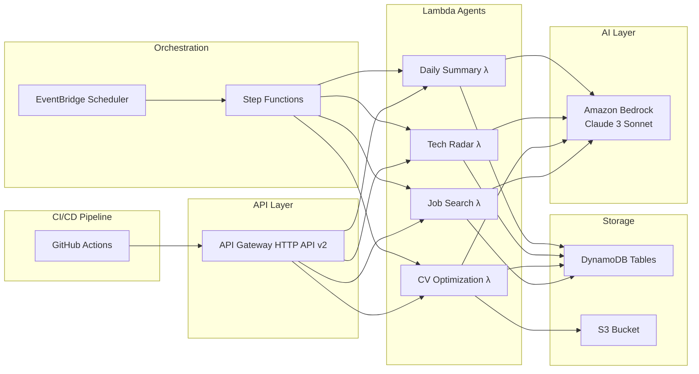

# 🤖 AWS Serverless AI Agent Platform

> **Originally:** Coursera IBM Capstone Project — The Battle of the Neighborhoods.
> **Extended with:** A production-grade, secure, scalable, cost-efficient Serverless AI Agent Platform on AWS.

---

# AWS AI Agent Platform

A **production-grade, secure, scalable, cost-efficient serverless AI Agent Platform** built on AWS, following the [AWS Well-Architected Framework](https://aws.amazon.com/architecture/well-architected/).

## 🏗️ Architecture Overview



> 📊 **Full interactive diagram**: see [`docs/architecture_diagram.md`](docs/architecture_diagram.md)
> 🐍 **Diagram-as-code** (Python `diagrams` library): see [`docs/architecture_diagram.py`](docs/architecture_diagram.py)

---

## 🎯 Agents

| Agent | Endpoint | Trigger | Storage |
|-------|----------|---------|---------|
| **Job Search** | `GET /jobs` | API Gateway / Step Functions | DynamoDB |
| **CV Optimization** | `POST /generate-cv` | API Gateway / Step Functions | DynamoDB + S3 |
| **Tech Radar** | `GET /tech-trends` | API Gateway / Step Functions | DynamoDB (with 24h cache) |
| **Daily Summary** | `GET /summary` | EventBridge (daily 07:00 UTC) | DynamoDB + SNS |

---

## 📁 Project Structure

```
.
├── .github/
│   └── workflows/
│       └── ci-cd.yml              # GitHub Actions CI/CD pipeline
├── docs/
│   ├── architecture_diagram.md    # Mermaid.js architecture diagram
│   └── architecture_diagram.py    # Python diagrams-as-code
├── infra/
│   ├── step_functions_definition.json   # Step Functions state machine
│   └── terraform/
│       ├── main.tf                # Root Terraform config
│       └── modules/
│           ├── api_gateway/       # HTTP API Gateway module
│           ├── dynamodb/          # DynamoDB table module
│           ├── eventbridge/       # EventBridge Scheduler module
│           ├── lambda/            # Lambda function module
│           └── step_functions/    # Step Functions module
├── services/
│   ├── job_agent/
│   │   └── handler.py             # Job Search Agent
│   ├── cv_agent/
│   │   └── handler.py             # CV Optimization Agent
│   ├── tech_radar_agent/
│   │   └── handler.py             # Tech Radar Agent
│   └── summary_agent/
│       └── handler.py             # Daily Summary Agent
├── shared/
│   ├── bedrock_client.py          # Amazon Bedrock wrapper
│   ├── dynamodb_helper.py         # DynamoDB helper utilities
│   └── response_formatter.py     # API Gateway response formatter
├── tests/
│   └── unit/
│       ├── test_job_agent.py
│       ├── test_cv_agent.py
│       ├── test_tech_radar_agent.py
│       ├── test_summary_agent.py
│       └── test_shared_utils.py
├── requirements.txt               # Lambda production dependencies
└── requirements-dev.txt           # Development + test dependencies
```

---

## 🚀 Step-by-Step Implementation Plan

### Phase 1 — Foundation

```bash
# 1. Create AWS account + enable MFA on root
# 2. Create an IAM admin user (never use root for daily work)
# 3. Configure AWS CLI
aws configure
# Enter: Access Key ID, Secret, region (us-east-1), output (json)

# 4. Enable Bedrock model access in AWS Console:
#    Bedrock → Model access → Request access to Claude 3 Sonnet
```

**Why?** — Least-privilege IAM and CLI configuration are the foundation of every secure AWS deployment.

### Phase 2 — Core Infrastructure

```bash
cd infra/terraform
terraform init -backend-config="bucket=YOUR_TF_STATE_BUCKET" \
               -backend-config="key=ai-agent-platform/dev/terraform.tfstate" \
               -backend-config="region=us-east-1"
terraform plan  -var="environment=dev"
terraform apply -var="environment=dev"
```

This creates:
- 4 DynamoDB tables (PAY_PER_REQUEST, encrypted, PITR enabled)
- S3 bucket for CVs (versioned, encrypted, no public access)
- API Gateway HTTP API
- All IAM roles with least-privilege policies

### Phase 3 — Compute Layer

Each Lambda function follows this structure:

```python
# services/<agent>/handler.py
import sys, os
sys.path.insert(0, os.path.join(os.path.dirname(__file__), "..", ".."))

from shared.bedrock_client import invoke_model
from shared.dynamodb_helper import put_item
from shared.response_formatter import success, error

def lambda_handler(event, context):
    # 1. Parse input
    # 2. Build prompt
    # 3. Call Bedrock
    # 4. Persist to DynamoDB
    # 5. Return response
```

### Phase 4 — AI Integration

```python
from shared.bedrock_client import invoke_model

response = invoke_model(
    prompt="Your structured prompt here",
    system_prompt="You are an expert ...",
    max_tokens=2048,
    temperature=0.5,
)
```

**Bedrock prompt engineering tips:**
- Always include `"Respond only with valid JSON"` in the system prompt
- Use JSON schema examples in the user prompt
- Set `temperature=0.3-0.5` for structured output tasks

### Phase 5 — Orchestration

The Step Functions workflow runs all agents in parallel:

```json
{
  "StartAt": "RunAgentsInParallel",
  "States": {
    "RunAgentsInParallel": {
      "Type": "Parallel",
      "Branches": [/* Job, CV, TechRadar agents */],
      "Next": "AggregateResults"
    },
    "GenerateDailySummary": { "Type": "Task", ... }
  }
}
```

Deploy via Terraform or AWS Console (upload `infra/step_functions_definition.json`).

### Phase 6 — Automation

EventBridge runs the orchestration daily at 07:00 UTC:

```
Schedule: cron(0 7 * * ? *)
Target:   Step Functions state machine (or Summary Lambda directly)
```

### Phase 7 — DevOps (CI/CD)

```yaml
# .github/workflows/ci-cd.yml
# Triggers on push to main/develop
# Steps: lint → test → terraform validate → security scan → deploy
```

Required GitHub Secrets:
- `AWS_DEPLOY_ROLE_ARN` — OIDC role ARN for dev deployment
- `AWS_DEPLOY_ROLE_ARN_PROD` — OIDC role ARN for prod deployment
- `TF_STATE_BUCKET` — S3 bucket for Terraform state (dev)
- `TF_STATE_BUCKET_PROD` — S3 bucket for Terraform state (prod)

### Phase 8 — Optimisation

See [Cost Optimisation](#-cost-optimisation) and [Security](#-security) sections below.

---

## 📡 API Reference

### `GET /jobs`

Search for job opportunities using AI.

**Query Parameters:**

| Parameter | Type | Default | Description |
|-----------|------|---------|-------------|
| `role` | string | `Software Engineer` | Target job role |
| `location` | string | `Remote` | Preferred location |
| `skills` | string | `Python,AWS` | Comma-separated skills |

**Example Request:**
```bash
curl "https://YOUR_API_ENDPOINT/jobs?role=Senior+Python+Engineer&location=Paris&skills=Python,AWS,Docker"
```

**Example Response:**
```json
{
  "search_id": "uuid-here",
  "role": "Senior Python Engineer",
  "location": "Paris",
  "jobs": [
    {
      "title": "Senior Python Engineer",
      "company": "TechCorp",
      "location": "Paris, France",
      "salary_range": "€70k - €90k",
      "required_skills": ["Python", "AWS"],
      "match_score": 92,
      "description": "Backend role with AWS focus",
      "application_tips": "Highlight cloud experience"
    }
  ],
  "market_insights": "Strong demand for Python engineers",
  "recommended_upskilling": ["Kubernetes", "Terraform"]
}
```

---

### `POST /generate-cv`

Optimise a CV for a target job description.

**Request Body:**
```json
{
  "cv_text": "John Doe — Software Engineer\nExperience: ...",
  "job_description": "Senior Python Developer at TechCorp\nRequirements: ..."
}
```

**Example Response:**
```json
{
  "cv_id": "uuid-here",
  "download_url": "https://s3.presigned.url/...",
  "match_score_before": 55,
  "match_score_after": 88,
  "improvements": [
    {
      "section": "Summary",
      "change": "Added ATS keywords",
      "reason": "Improves applicant tracking system matching"
    }
  ],
  "ats_keywords_added": ["Terraform", "Docker"],
  "executive_summary": "Experienced Python engineer..."
}
```

---

### `GET /tech-trends`

Get a Tech Radar assessment for a technology category.

**Query Parameters:**

| Parameter | Type | Default | Description |
|-----------|------|---------|-------------|
| `category` | string | `Cloud Native` | Technology category |

**Example Response:**
```json
{
  "source": "bedrock",
  "data": {
    "category": "Cloud Native",
    "rings": {
      "adopt": [{"name": "Kubernetes", "description": "Production-ready", ...}],
      "trial": [...],
      "assess": [...],
      "hold": [...]
    },
    "key_trends": ["GitOps adoption", "FinOps"],
    "investment_recommendations": "Invest in Kubernetes and GitOps skills."
  }
}
```

---

### `GET /summary`

Retrieve the latest daily career intelligence summary.

**Example Response:**
```json
{
  "summary_id": "uuid-here",
  "date": "2024-01-15",
  "headline": "Strong demand for Python engineers; Cloud Native is top tech trend",
  "job_market_pulse": { ... },
  "cv_insights": { ... },
  "tech_spotlight": { ... },
  "action_items": [ ... ],
  "motivational_insight": "Your cloud skills are highly sought after!"
}
```

---

## 🔁 Step Functions Workflow

The orchestrator (`infra/step_functions_definition.json`) implements:

1. **Parallel execution** — Job, CV, and Tech Radar agents run simultaneously.
2. **Retry policy** — Up to 3 retries with exponential backoff for transient Lambda errors.
3. **Error handling** — Each branch catches `States.ALL` and passes a failure marker rather than stopping the workflow.
4. **Aggregation** — Results are merged before the Summary agent consumes them.
5. **Tracing** — X-Ray tracing enabled for end-to-end visibility.

```
RunAgentsInParallel ──┬─► JobSearchAgent  ──┐
                      ├─► CVAgent          ──┼─► AggregateResults ──► GenerateDailySummary ──► WorkflowSucceeded
                      └─► TechRadarAgent   ──┘
```

---

## 🔐 Security

### Implemented Controls

| Control | Implementation |
|---------|----------------|
| Least-privilege IAM | Each Lambda role scoped to specific table ARNs and model ARN |
| No hardcoded secrets | All credentials via IAM roles; API keys via Secrets Manager |
| Encryption at rest | DynamoDB SSE enabled; S3 AES-256; SNS KMS |
| Encryption in transit | All services use TLS by default |
| API protection | API Gateway throttling: 100 burst / 50 RPS |
| CORS | Configured explicitly on API Gateway |
| No public S3 | `BlockPublicAccess` fully enabled on CV bucket |
| PITR | DynamoDB Point-in-Time Recovery enabled |
| Log retention | CloudWatch log groups: 14-day retention |
| OIDC deployment | GitHub Actions uses OIDC (no long-lived AWS keys) |

---

## 💰 Cost Optimisation

### Lambda
- **ARM64 architecture** — ~20% cheaper + faster for Python workloads (add `architectures = ["arm64"]` to Terraform module).
- **Right-size memory** — Start at 512MB, profile with Lambda Power Tuning.
- **Provisioned Concurrency** — Only for production high-traffic endpoints.

### Amazon Bedrock
- Use `max_tokens` to cap output size and cost.
- Implement **caching** (Tech Radar agent caches for 24h by default).
- Prefer **Haiku** for classification tasks; **Sonnet** for complex generation.
- Monitor token usage with CloudWatch custom metrics.

### DynamoDB
- **PAY_PER_REQUEST** billing for variable/unpredictable traffic.
- Set **TTL** on summary items after 90 days.
- Use **projection expressions** to fetch only needed attributes.

### Estimated Monthly Cost (Dev)

| Service | Estimated Cost |
|---------|---------------|
| Lambda (1M invocations) | ~$0.20 |
| API Gateway (1M requests) | ~$1.00 |
| DynamoDB (PAY_PER_REQUEST) | ~$1-5 |
| S3 (1GB storage) | ~$0.023 |
| Bedrock (Claude 3 Sonnet, 1M tokens) | ~$15 |
| Step Functions | ~$0.025 per 1000 state transitions |
| **Total** | **~$20-25/month** |

---

## 🧪 Testing

### Run Unit Tests

```bash
pip install -r requirements-dev.txt
pytest tests/unit/ -v --cov=services --cov=shared
```

### Test Structure

All tests use `unittest.mock` to patch AWS SDK calls — **no real AWS credentials required**.

```python
@patch("boto3.client")
@patch("boto3.resource")
def test_successful_job_search(self, mock_resource, mock_client):
    # Mock Bedrock response
    bedrock_mock = MagicMock()
    bedrock_mock.invoke_model.return_value = _make_bedrock_response(SAMPLE_JOBS_JSON)
    mock_client.return_value = bedrock_mock

    response = handler.lambda_handler(event, {})
    assert response["statusCode"] == 200
```

---

## 🧠 AWS Well-Architected Framework Alignment

| Pillar | Implementation |
|--------|---------------|
| **Security** | IAM least-privilege, encryption everywhere, no public access, OIDC CI/CD |
| **Reliability** | Lambda retries, Step Functions error handling, DynamoDB PITR, multi-AZ by default |
| **Performance Efficiency** | Serverless auto-scaling, parallel Step Functions execution, DynamoDB cache |
| **Cost Optimisation** | PAY_PER_REQUEST DynamoDB, on-demand Lambda, Bedrock token capping |
| **Operational Excellence** | CloudWatch dashboard, X-Ray tracing, structured JSON logs, IaC (Terraform) |

---

## 🏆 Portfolio Highlights

This project demonstrates:

- ✅ **Full serverless architecture** — zero servers to manage
- ✅ **Event-driven design** — EventBridge + Step Functions orchestration
- ✅ **Multi-agent AI** — 4 specialised agents backed by Amazon Bedrock
- ✅ **Infrastructure as Code** — Terraform with reusable modules
- ✅ **DevOps maturity** — GitHub Actions CI/CD with OIDC authentication
- ✅ **Security by design** — least-privilege IAM, encryption, no hardcoded secrets
- ✅ **Cost-conscious** — PAY_PER_REQUEST, token capping, response caching
- ✅ **Observable** — CloudWatch dashboards, X-Ray tracing, structured logs
- ✅ **Tested** — Unit tests with mocked AWS services, coverage reporting

---

*Built as a portfolio project targeting the AWS Certified Machine Learning — Specialty and AWS Certified Solutions Architect — Professional certifications.*

---

## 📚 Original IBM Capstone Project

The Battle of the Neighborhoods - Part 1
Introduction & Business Problem :
Introduction

Retail has always been shaped by shrewd merchants with a proclivity for taking risks and choosing the right products at the right time. This has always been considered more of an art than a science. However, with the tools to leverage consumer data, “Winning decisions are increasingly driven by analytics more than instinct, experience, or merchant ‘art’. By leveraging smarter tools—those beyond backward-looking, “hind sighting” analysis—retailers can increasingly make forward-looking predictions that are quickly becoming the “table stakes” necessary to keep up”, says Mckinsey.

In a rapidly evolving world where busy bustling cities are booming with opportunity, when opening a new business, it is of paramount importance to do your homework in order to decide if the location for consideration is going to prove a profitable exercise. As a data scientist, it is my job to assist my clients in their decision-making process.
Problem Background:

The City of New York, is the most populous city in the United States. It is diverse and is the financial capital of USA. It is multicultural. It provides lot of business oppourtunities and business friendly environment. It has attracted many different players into the market. It is a global hub of business and commerce. The city is a major center for banking and finance, retailing, world trade, transportation, tourism, real estate, new media, traditional media, advertising, legal services, accountancy, insurance, theater, fashion, and the arts in the United States.

This also means that the market is highly competitive. As it is highly developed city so cost of doing business is also one of the highest. Thus, any new business venture or expansion needs to be analysed carefully. The insights derived from analysis will give good understanding of the business environment which help in strategically targeting the market. This will help in reduction of risk. And the Return on Investment will be reasonable.
Problem Description:

A restaurant is a business which prepares and serves food and drink to customers in return for money, either paid before the meal, after the meal, or with an open account. The City of New York is famous for its excelllent cuisine. It's food culture includes an array of international cuisines influenced by the city's immigrant history.

    Central and Eastern European immigrants, especially Jewish immigrants - bagels, cheesecake, hot dogs, knishes, and delicatessens

    Italian immigrants - New York-style pizza and Italian cuisine

    Jewish immigrants and Irish immigrants - pastrami and corned beef

    Chinese and other Asian restaurants, sandwich joints, trattorias, diners, and coffeehouses are ubiquitous throughout the city mobile food vendors - Some 4,000 licensed by the city

    Middle Eastern foods such as falafel and kebabs examples of modern New York street food

    It is famous for not just Pizzerias, Cafe's but also for fine dining Michelin starred restaurants.The city is home to "nearly one thousand of the finest and most diverse haute cuisine restaurants in the world", according to Michelin.

    So it is evident that to survive in such competitive market it is very important to startegically plan. Various factors need to be studied inorder to decide on the Location such as :

(i) New York Population

(ii) New York City Demographics

(iii) Are there any Farmers Markets, Wholesale markets etc nearby so that the ingredients can be purchased fresh to maintain quality and cost?

(vi) Are there any venues like Gyms, Entertainmnet zones, Parks etc nearby where floating population is high etc

(v) Who are the competitors in that location?

(vi) Segmentation of the Borough

(vii) Untapped markets

(viii) Saturated markets

(xi) Cuisine served / Menu of the competitors . The list can go on...

Eventhough well funded XYZ Company Ltd. need to choose the correct location to start its first venture.If this is successful they can replicate the same in other locations. First move is very important, thereby choice of location is very important.
Target:

To recommend the correct location, XYZ Company Ltd has appointed me to lead of the Data Science team. The objective is to locate and recommend to the management which neighborhood of Newyork city will be best choice to start a restaurant. The Management also expects to understand the rationale of the recommendations made.

This would interest anyone who wants to start a new restaurant in Newyork city.
Success Criteria:

The success criteria of the project will be a good recommendation of borough/Neighborhood choice to XYZ Company Ltd based on Lack of such restaurants in that location and nearest suppliers of ingredients.
Data Section:
Geonames :

This will be used to obtain necessary data for the neighbourhoods, postal codes and geographic coordinates in Alberta. This website also offers the option of downloading the data into text files which enables one to format and import a CSV with the necessary dataset.
Foursquare :

This API will be used to leverage and explore venue data to target recommended locations for the prospective business venture.

By merging the data from Geonames and Foursquare we will be able to conclude where starting a non-franchised coffee shop / book store would prove most profitable.
