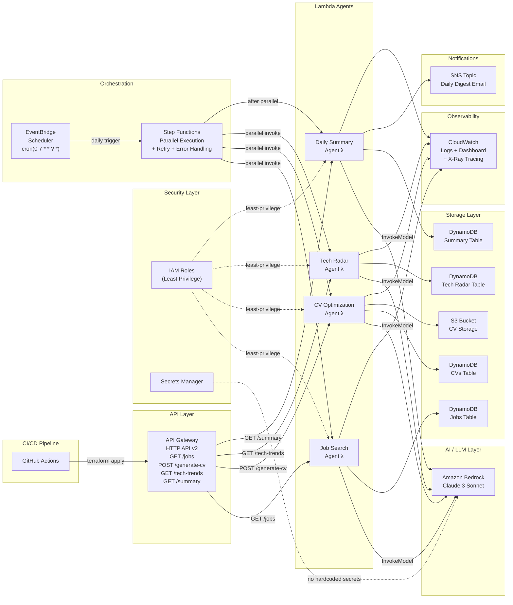

# Architecture Diagram — Mermaid.js

The diagram below can be rendered at [mermaid.live](https://mermaid.live),
in GitHub Markdown, or any Mermaid-compatible tool.

## Data Flow (End-to-End)

1. **User request** arrives at API Gateway over HTTPS.
2. API Gateway **routes** the request to the appropriate Lambda agent.
3. The Lambda agent **builds a structured prompt** from request parameters.
4. The agent calls **Amazon Bedrock** (Claude 3 Sonnet) via the shared `bedrock_client` utility.
5. Bedrock returns a **structured JSON response**.
6. The agent **persists results** to DynamoDB (and S3 for CVs).
7. The agent **returns the response** to API Gateway → client.
8. **Daily at 07:00 UTC** EventBridge triggers Step Functions.
9. Step Functions runs all agents **in parallel**, then calls the Summary agent.
10. The Summary agent **aggregates** all recent results and publishes to SNS.

## Event-Driven Triggers

| Trigger | Target | Schedule / Event |
|---------|--------|-----------------|
| EventBridge Scheduler | Step Functions | `cron(0 7 * * ? *)` — 07:00 UTC daily |
| API Gateway | Lambda (all agents) | On every HTTP request |
| Step Functions | Lambda (all agents) | On workflow execution |
